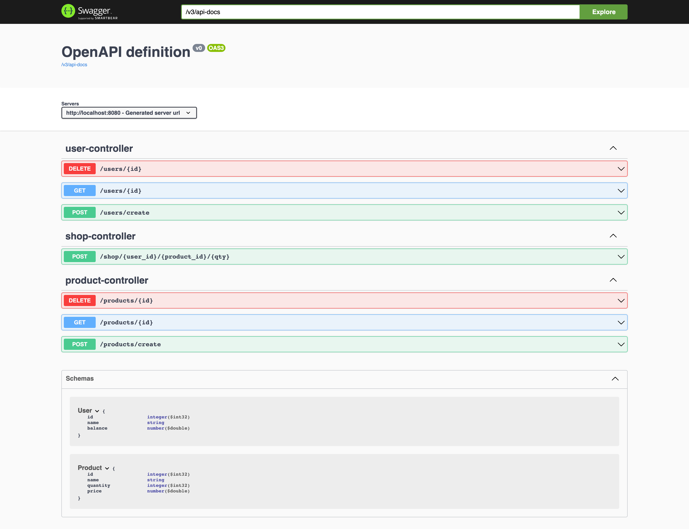

# tigris-starter-java
A starter Java application for Tigris.

# Quick start
 - [documentation](https://docs.tigrisdata.com/quickstart/with-java)

# Restful endpoints

This starter application exposes restful endpoints, to play around with it. 
Go to http://localhost:8080/swagger.html

# Note

We are still in pre-release and so `SNAPSHOT` artifacts maybe consumed.